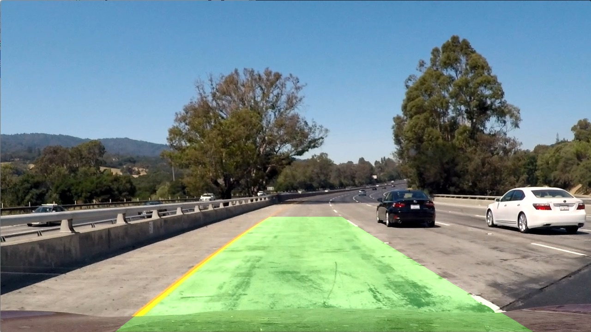

# Lane Finder

Finds lane in images and videos taken from a car's perspective using  
computer vision techniques.

## Environment Setup

* Python 3
* NumPy 1.15.1
* OpenCV 3.4.2
* Matplotlib 2.2.3
* MoviePy 0.2.3.5

1. Clone this repo
2. ```~$ conda env create -f environment.yml```  
3. ```~$ source activate environment```

## Usage

Run on test images and videos in examples/ of this repo

Image example:


```~$ python lane_finder.py examples/test1.jpg```

Output:



Video example:

```~$ python lane_finder.py examples/video.mp4```


